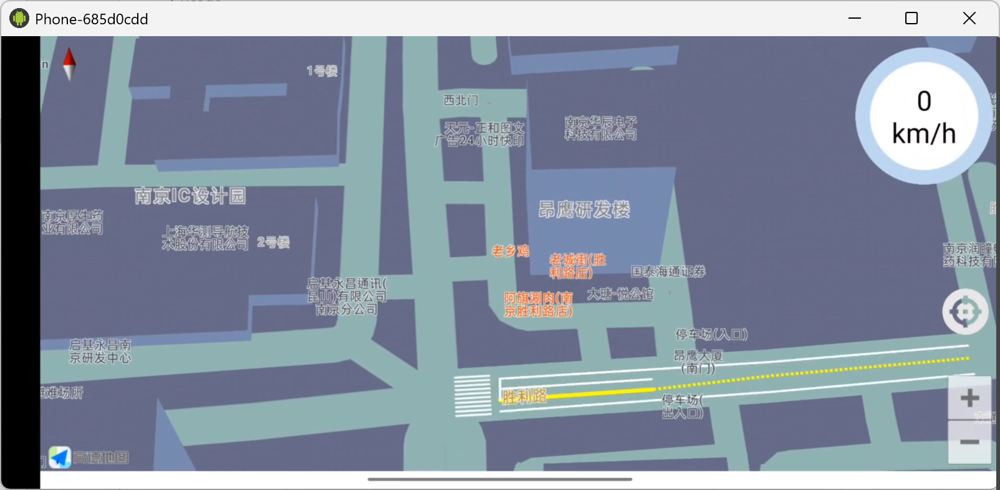

# CAICCar / CVM 高德地图车载 HMI

一个基于 Android 原生开发的车载 HMI 演示项目，集成高德地图 SDK，用于展示车辆位置、道路事件、交通信号灯、预警提示、建议车速等车路协同相关信息。

## 项目截图



## 功能特性

- 高德地图展示：支持地图加载、定位、缩放、倾角调整与自定义地图样式。
- 车载横屏界面：应用固定横屏显示，适配车机/模拟器宽屏场景。
- 车辆信息展示：展示主车速度、车辆位置及道路标记信息。
- 预警信息展示：支持前向碰撞、行人、拥堵、道路异常等预警提示。
- 交通灯信息展示：展示左转、直行、右转信号灯状态、倒计时与建议车速。
- 数据接收处理：通过 UDP 端口 `4041` 接收 CVM JSON 数据并刷新地图和 HMI。
- 语音提示资源：内置多种交通事件与安全预警音频资源。

## 技术栈

- 开发语言：Java
- 构建工具：Gradle 5.4.1
- Android Gradle Plugin：3.5.2
- Android SDK：compileSdkVersion 30，targetSdkVersion 29
- 地图能力：高德地图 3DMap / Navi / Search / Location SDK
- 通信依赖：Eclipse Paho MQTT
- UI 框架：AndroidX AppCompat、ConstraintLayout、Material Components

## 目录结构

```text
.
├── app/
│   ├── libs/                         # 高德 SDK JAR 与 native so
│   └── src/main/
│       ├── assets/                   # 地图样式与字体资源
│       ├── java/com/example/cvm/     # 主要业务代码
│       │   ├── Data/                 # 数据模型
│       │   ├── cube/                 # 3D 渲染相关代码
│       │   ├── model/                # 地图渲染模型
│       │   ├── MainActivity.java     # 主地图与 HMI 页面
│       │   ├── WelcomeActivity.java  # 欢迎页
│       │   └── CarActivity.java      # 车辆信息弹窗页面
│       └── res/                      # 布局、图片、音频等资源
├── gradle/wrapper/                   # Gradle Wrapper
├── build.gradle                      # 根项目构建配置
├── settings.gradle                   # Gradle 模块配置
└── ScreenShot_2026-06-28_102132_469.png
```

## 环境要求

- Android Studio 3.5 或更高版本
- JDK 8
- Android SDK Platform 30
- Android Build Tools 30.0.0
- 可访问 `google()`、`jcenter()` 及 Gradle Wrapper 配置的镜像源
- 真机或模拟器需支持横屏，并授予定位、网络、存储等权限

## 运行步骤

1. 使用 Android Studio 打开项目根目录。
2. 确认 `local.properties` 中的 Android SDK 路径正确，例如：

```properties
sdk.dir=C\:\\development\\Android\\sdk
```

3. 同步 Gradle 依赖。
4. 确认高德地图 Key 已在 `app/src/main/AndroidManifest.xml` 的 `com.amap.api.v2.apikey` 中配置。
5. 连接 Android 设备或启动模拟器。
6. 运行 `app` 模块，应用会先进入欢迎页，约 1.5 秒后跳转到主地图界面。

也可以在命令行构建 Debug 包：

```powershell
.\gradlew.bat assembleDebug
```

构建产物通常位于：

```text
app/build/outputs/apk/debug/app-debug.apk
```

## 数据输入说明

主界面启动后会监听 UDP 端口 `4041`，接收 CVM JSON 数据。接收到数据后，应用会解析车辆、事件、预警、交通灯和障碍物信息，并更新地图标记、车速、预警图标、信号灯倒计时与语音提示。

主要数据类型包括：

- `VehicleInfo`：车辆 ID、类型、经纬度、航向角、速度等。
- `EventInfo`：道路事件 ID、类型、名称及相对位置。
- `WarningInfo`：预警 ID、优先级、等级和提示内容。
- `RoadInfo`：信号灯相位、剩余时间、建议通行状态和建议速度。
- `ObstacleInfo`：障碍物 ID、类型、经纬度和航向角。
- `RscInfo`：路侧协同信息。

## 权限说明

应用会申请以下权限以支持地图、定位、网络通信和资源访问：

- 网络访问：`INTERNET`、`ACCESS_NETWORK_STATE`
- Wi-Fi 状态：`ACCESS_WIFI_STATE`、`CHANGE_WIFI_STATE`
- 定位：`ACCESS_COARSE_LOCATION`、`ACCESS_FINE_LOCATION`、`ACCESS_LOCATION_EXTRA_COMMANDS`
- 存储：`READ_EXTERNAL_STORAGE`、`WRITE_EXTERNAL_STORAGE`
- 设备状态：`READ_PHONE_STATE`
- 蓝牙：`BLUETOOTH`、`BLUETOOTH_ADMIN`

## 注意事项

- 当前工程使用较旧版本的 Android Gradle Plugin 和 `jcenter()`，首次同步可能受网络或仓库可用性影响。
- 高德地图 SDK 与 so 文件位于 `app/libs`，请勿随意删除。
- 高德地图 Key 与应用包名、签名有关，如更换包名或签名，需要同步更新高德控制台配置。
- 项目默认横屏运行，适合车机、平板或横屏模拟器展示。
- 如果地图无法加载，请检查网络权限、设备定位权限、高德 Key、包名和签名配置。
